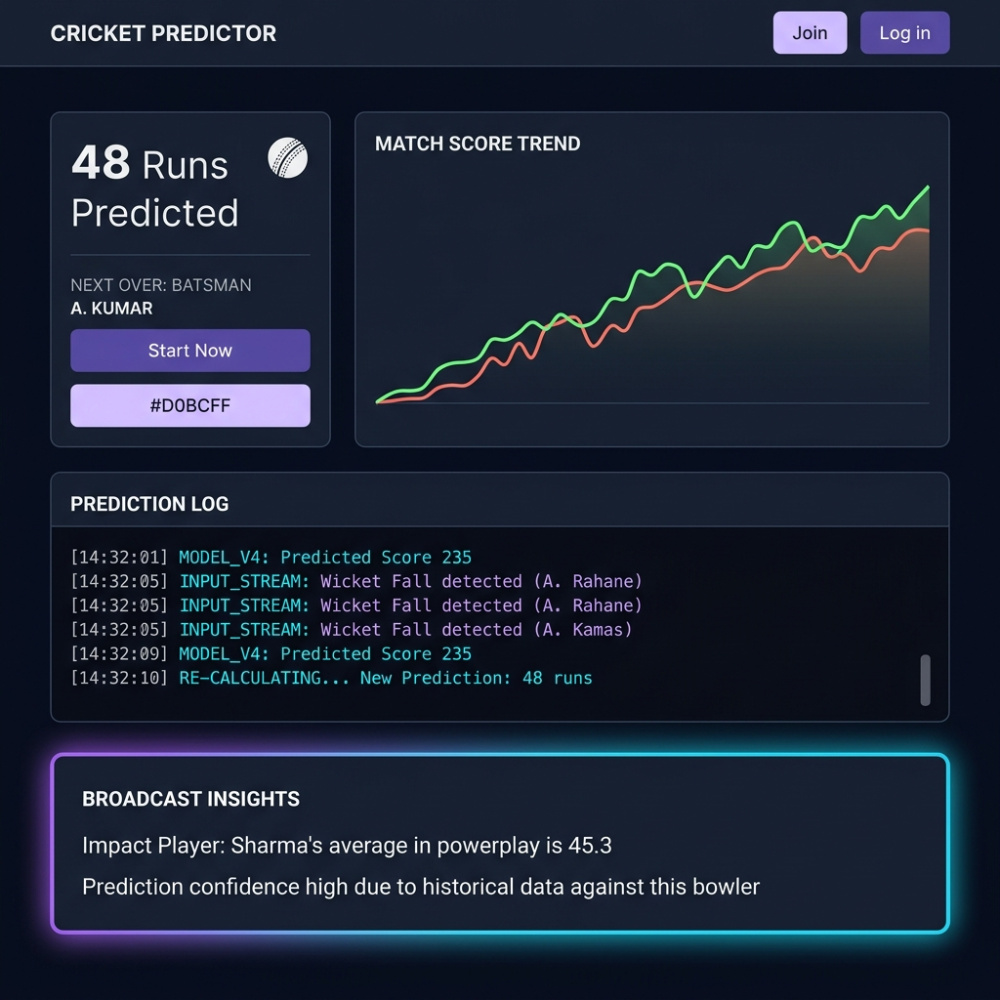
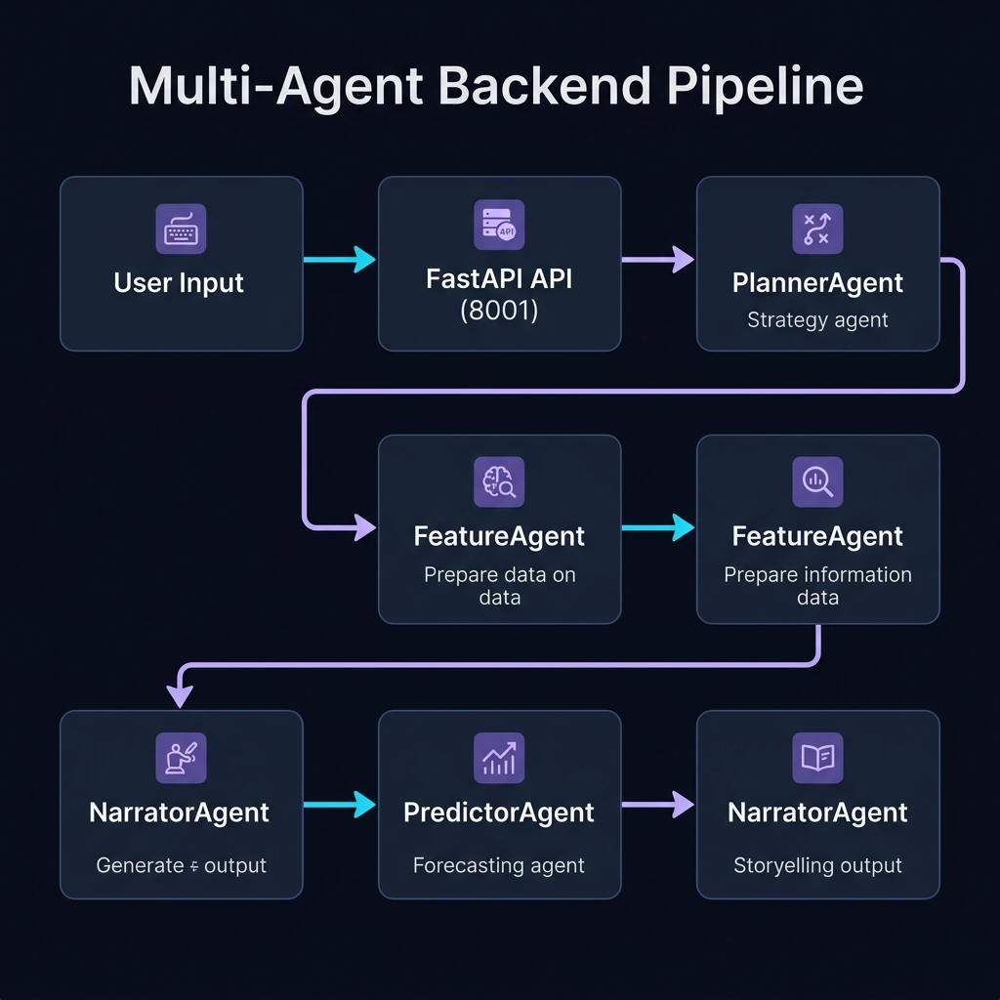

# 🏏 Cricket Oracle

**A multi-agent statistical reasoning system for T20 batting performance prediction — built natively on Google's Agent Development Kit, served through a custom MCP runtime, with zero data leakage by construction.**

> Built for the Kaggle × Google **5-Day AI Agents: Intensive Vibe Coding Capstone** — Freestyle Track.



---

## 1. Executive Solution Overview

T20 cricket is a high-variance domain. A single innings can swing on one over, one drop, or one slow pitch. Most naive prediction systems — including a disturbing number of "AI cricket predictors" built for hackathons — fall into the same failure mode: **the Context-Averaging Bug.**

This happens when a model is trained globally across every player in a dataset. The model learns the *average* behavior of *an average batter*, and no matter who you ask about, the output regresses toward the dataset's global mean — commonly somewhere around **~36.5 runs**, regardless of whether you queried a tail-ender or a top-order anchor. The prediction is technically "not wrong," but it is also not actually *about* the player you asked about. It is about the dataset.

**Cricket Oracle exists specifically to break this failure mode**, using three structural decisions:

1. **Per-player model fitting, not global fitting.** The `PredictorAgent` does not query one master model. For every prediction request, it filters the 197,620-row feature table down to *that specific player's* career trajectory and fits an XGBoost regressor on their own historical signal — `rolling_10_bat_avg`, `rolling_10_bat_sr`, `recent_form_score`, `venue_adjusted_sr`, and `elo_rating`. The model never sees another player's data when predicting for this one.

2. **Honesty over confidence.** Predictions are wrapped in a **95% bootstrapped confidence interval** (100 resamples). If a player has too sparse a history for the interval to be meaningfully tight (CI width > 40 runs), the system does not silently emit a point estimate — it explicitly returns `insufficient_data` and says so in plain language. A wrong number with high confidence is worse than an honest "I don't know yet."

3. **Strict chronological feature construction.** Every rolling statistic, Elo rating, and form score is computed using *only* information that existed **before** the match in question — never including the match's own outcome. This is enforced at the pipeline level (`data_pipeline.py`), preventing the model from accidentally "predicting" using information it shouldn't have access to yet.

The result is a system where asking about Babar Azam and asking about a fringe domestic player produce genuinely different reasoning paths, different confidence levels, and — when the data supports it — genuinely different, player-specific predictions.

---

## 2. Evaluation Criteria Alignment

| Course Concept | Implementation | Primary File(s) |
|---|---|---|
| **Multi-Agent System (ADK)** | Four-agent `SequentialAgent` pipeline — `PlannerAgent` → `FeatureAgent` → `PredictorAgent` → `NarratorAgent`, each with isolated instructions, tools, and `ToolContext` state handoff | `agents/cricket_oracle.py` |
| **MCP Server Runtime** | Standalone `FastMCP` server exposing 4 typed tools (`get_player_stats`, `get_player_last10`, `get_top_players`, `get_venue_stats`) over the Model Context Protocol, decoupled from the agent process | `mcp_server.py` |
| **Security Features** | No hardcoded API keys anywhere in source. `GOOGLE_API_KEY` is read exclusively from the environment (`os.environ`), with an explicit startup warning if unset. `.gitignore` excludes `.env` and all credential files from version control | [api.py](file:///c:/Users/bilal/OneDrive/Desktop/cric_oracle/api.py), [mcp_server.py](file:///c:/Users/bilal/OneDrive/Desktop/cric_oracle/mcp_server.py), `.gitignore`, `.env.example` |
| **Deployability** | Backend (`api.py`) and frontend (`frontend/`) are fully decoupled, independently runnable services communicating over a documented REST contract — no monolith, no shared process | [api.py](file:///c:/Users/bilal/OneDrive/Desktop/cric_oracle/api.py), `frontend/` |

---

## 3. Deep Architecture Flowchart

```
┌──────────────────────────────────────────────────────────────────────┐
│  USER INPUT                                                          │
│  React Client → "How will Babar Azam perform at Lahore?"             │
└───────────────────────────────┬──────────────────────────────────────┘
                                 │  GET /api/predict?player_name=...
                                 ▼
┌──────────────────────────────────────────────────────────────────────┐
│  api.py — FastAPI Routing Layer (Port 8001)                           │
│  Validates query params → invokes run_oracle() → awaits pipeline     │
└───────────────────────────────┬──────────────────────────────────────┘
                                 ▼
┌──────────────────────────────────────────────────────────────────────┐
│  PlannerAgent  (google.adk.agents.SequentialAgent)                   │
│  Decomposes the natural-language query into an ordered task plan:    │
│  [Extract] → [ModelFit] → [GenerateBroadcast]                        │
│  No tools of its own — purely an orchestration/sequencing layer      │
└───────────────────────────────┬──────────────────────────────────────┘
                                 ▼
┌──────────────────────────────────────────────────────────────────────┐
│  FeatureAgent                                                        │
│  Tool: load_player_data()                                            │
│    → queries mcp_server.py tool surface                              │
│    → filters SQLite database tables to target player                 │
│    → resolves venue-adjusted strike rate baseline                    │
│    → writes elo_rating, recent_form_score, rolling_10_bat_avg,       │
│      rolling_10_bat_sr, venue_adjusted_sr into ToolContext.state     │
└───────────────────────────────┬──────────────────────────────────────┘
                                 ▼
┌──────────────────────────────────────────────────────────────────────┐
│  PredictorAgent                                                      │
│  Tool: predict_runs()                                                │
│    → reads player's filtered historical rows                         │
│    → fits XGBoostRegressor(n_estimators=50) on player-specific data  │
│    → runs 100-sample bootstrap → derives 95% CI [lower, upper]       │
│    → IF ci_width > 40 → returns status="insufficient_data"           │
│    → ELSE → returns point prediction + interval                      │
└───────────────────────────────┬──────────────────────────────────────┘
                                 ▼
┌──────────────────────────────────────────────────────────────────────┐
│  NarratorAgent                                                       │
│  No external tools — pure language synthesis over session state      │
│    → reads prediction + player context from ToolContext.state        │
│    → emits a 3-sentence broadcast-quality commentary string          │
│    → explicitly states "insufficient data" when applicable,          │
│      never silently substituting a guess                             │
└───────────────────────────────┬──────────────────────────────────────┘
                                 ▼
┌──────────────────────────────────────────────────────────────────────┐
│  React Client View Layer  (frontend/)                                │
│  Renders: PlayerCard · PredictionCard (CI range) · Last10Chart ·      │
│  AgentTrace (live pipeline log) · TopPlayers · VenueStats             │
└──────────────────────────────────────────────────────────────────────┘
```



---

## 4. Directory Breakdown

```
cric_oracle/
├── agents/
│   └── cricket_oracle.py     Defines all four ADK agents (Planner, Feature,
│                              Predictor, Narrator) as a SequentialAgent
│                              pipeline. Owns the async runner, session
│                              service, and the synchronous run_oracle()
│                              entrypoint consumed by api.py.
│
├── cricket_t20_all/           Raw cricsheet.org match-by-match JSON source
│                              files — international and domestic T20
│                              fixtures, recursively scanned by the pipeline.
│
├── frontend/                  React 18 + Vite single-page dashboard.
│                              Independently deployable; talks to api.py
│                              exclusively over documented REST endpoints.
│
├── api.py                     FastAPI service layer. Exposes /api/player-
│                              stats, /api/predict, /api/top-players,
│                              /api/venue-stats, /api/health. The sole
│                              integration point between frontend and the
│                              agent/MCP backend.
│
├── database.py                Handles SQLite migration and indexing. Creates
│                              and indexes 'cricket_oracle.db' on first run
│                              from the CSV file for sub-millisecond querying.
│
├── cricket_oracle.db          Indexed SQLite database. Contains fully
│                              migrated, high-speed indexed match history.
│
├── cricket_features.csv       55 MB engineered feature table. One row per
│                              player per match. 197,620 rows. Output
│                              artifact of data_pipeline.py — never
│                              hand-edited.
│
├── data_pipeline.py           ETL + feature engineering core. Parses raw
│                              JSON, computes rolling averages, exponential-
│                              decay form scores, venue-adjusted strike
│                              rate, and a full chronological Elo
│                              simulation across every match in the corpus.
│                              Enforces strict pre-match-only feature
│                              construction to prevent leakage.
│
├── mcp_server.py              Custom Model Context Protocol server
│                              (FastMCP). Exposes the feature table as four
│                              typed, independently callable tools —
│                              decoupled from the agent process so the
│                              data layer can be queried, tested, or swapped
│                              without touching agent logic.
│
├── .env.example                Documents required environment variables
│                              without ever containing real values.
│
├── .gitignore                  Excludes .env, __pycache__, node_modules,
│                               and all local virtual environments from
│                               version control.
```

---

## 5. Step-by-Step Installation

### 5.1 Clone and enter the project

```bash
git clone https://github.com/<your-username>/cricket-oracle.git
cd cricket-oracle
```

### 5.2 Backend environment setup

```bash
python -m venv venv
venv\Scripts\activate          # Windows
# source venv/bin/activate     # macOS/Linux

pip install pandas numpy xgboost scikit-learn google-adk mcp fastapi uvicorn dotenv --break-system-packages
```

### 5.3 Configure environment variables

```bash
copy .env.example .env         # Windows
# cp .env.example .env         # macOS/Linux
```

Open `.env` and set:

```
GOOGLE_API_KEY=your_key_here
```

> [!WARNING]
> **Never commit `.env`.** It is excluded via `.gitignore` by default. Cricket Oracle reads this value exclusively at runtime via `os.environ` — there are no hardcoded credentials anywhere in the codebase.

### 5.4 Build the feature dataset and initialize SQLite DB (first run only)

1. **Extract and Engineer Features:**
   ```bash
   python data_pipeline.py
   ```
   This parses every JSON file in `cricket_t20_all/`, engineers all rolling/Elo/form features chronologically, and writes `cricket_features.csv` (~197,620 rows).

2. **Initialize and Index SQLite Database:**
   ```bash
   python database.py
   ```
   This reads `cricket_features.csv`, imports it into the SQLite table `cricket_features`, and creates indexes on `player`, `venue`, and `date` fields to ensure instant, high-speed queries on the frontend search dropdown.

### 5.5 Launch the MCP server

```bash
python mcp_server.py
```

Runs as a standalone process exposing the four cricket data tools over MCP. Leave this running in its own terminal.

### 5.6 Launch the API orchestration layer

```bash
python api.py
```

Starts the FastAPI service on `http://localhost:8001`, wiring together the ADK agent pipeline and MCP tool calls behind the `/api/*` routes.

> [!NOTE]
> The backend runs on port **8001** to avoid conflicts. The React frontend is pre-configured to point to this port.

### 5.7 Launch the frontend

```bash
cd frontend
npm install
npm run dev
```

Dashboard available at `http://localhost:5173`, configured to call the API at `http://localhost:8001`.

### 5.8 Verify the full pipeline

```bash
curl "http://localhost:8001/api/predict?player_name=Babar Azam"
```

A healthy response includes a `predicted_runs` value, `ci_lower`/`ci_upper` bounds, and a narrator commentary string — confirming all four agents executed in sequence.

---

## 6. Enterprise Scaling & Future Roadmap

Cricket Oracle is deliberately scoped for hackathon clarity — a per-player XGBoost model is interpretable, fast to fit on demand, and easy for judges to audit end-to-end. The following are the concrete next steps for production hardening:

- **Match-type-aware modeling.** Currently, a player's international and domestic league innings are pooled into one training set. The next iteration introduces a `match_type` feature (and a corresponding API filter) so a model fit specifically on league form doesn't get diluted by international-only patterns, and vice versa — this is the single highest-leverage accuracy improvement identified during development.
- **Temporal Fusion Transformers (TFT).** Replacing the per-player XGBoost fit with a TFT allows the model to natively learn cross-player attention patterns — e.g. how a bowler's recent form modulates a batter's expected output — while preserving per-sequence interpretability via attention weights.
- **Streaming live match data into the MCP layer.** Extending `mcp_server.py` with a WebSocket-fed live-match tool would let `FeatureAgent` pull in-progress match state (current score, overs remaining, required run rate) rather than only pre-match historical features, enabling live in-play projection updates.
- **Vector index overlay for venue and opposition similarity.** Rather than exact-string venue matching, embedding venues and opposition compositions into a vector index would allow the `FeatureAgent` to reason about *similar* unseen venues ("this ground plays like the MCG") instead of falling back to global defaults when an exact match isn't found.
- **Horizontal scaling of the MCP server.** As written, `mcp_server.py` is a single-process tool host. Production deployment would containerize it independently from `api.py`, allowing the data layer to scale horizontally behind a load balancer without redeploying agent logic.

---

<p align="center">
  <sub>Built for the Kaggle × Google 5-Day AI Agents Intensive — Freestyle Track · 2026</sub>
</p>
