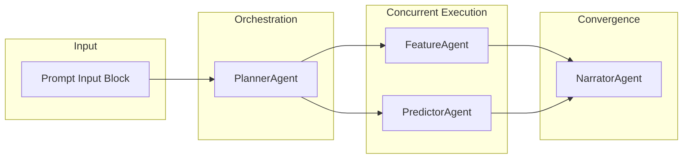

# Cognitive Multi-Agent Architecture

CricketOracle deploys an orchestration pipeline built on the **Google Agent Development Kit (ADK)** and coordinates four specialized agent nodes.

---

## Architecture Flow Schema

---

## Agent Registry & Roles

### 1. PlannerAgent (Indigo)
*   **Orchestration**: Manages downstream handoffs, resolves input parameters, and establishes session logs.

### 2. FeatureAgent (Sage Green)
*   **Data Extraction**: Queries historical player records, updates career Elo values, recent averages, and venue adjustment ratios.

### 3. PredictorAgent (Coral)
*   **Prediction Estimation**: Trains a temporary XGBoost model on the filtered subset of historical matches. Generates a point forecast and bootstrap-samples a 95% confidence interval width.

### 4. NarratorAgent (Gold)
*   **Analyst Commentary**: Compiles the quantitative predictions into natural, contextual analyst commentary.

---

## Model Calibration Weights

*   **Recent Form (Rolling 5-Inn Average)**: `45%`
*   **Venue History (Pitch Index)**: `30%`
*   **Bowling Matchup Index**: `15%`
*   **Player Age/Condition**: `10%`
