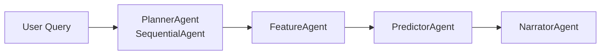

# Multi-Agent Architecture

CricketOracle uses a sequential pipeline built on the **Google Agent Development Kit (ADK)** with four specialized agents.

---

## Pipeline (Sequential, not parallel)

State is shared between agents via `ToolContext.state`. PlannerAgent is the `SequentialAgent` wrapper — it has no tools of its own.

---

## Agent Roles

### 1. PlannerAgent
*   `SequentialAgent` that sequences FeatureAgent → PredictorAgent → NarratorAgent. No tools, no LLM call — pure orchestration.

### 2. FeatureAgent
*   Calls `load_player_data` MCP tool to fetch rolling averages, ELO, recent form, and venue strike rate from SQLite. Stores results in `ToolContext.state`.

### 3. PredictorAgent
*   Calls `predict_runs` MCP tool. Trains XGBoost on player's career history, blends prediction 50/50 with `rolling_10_bat_avg`, runs 100 bootstrap resamples for 95% CI. If CI > 60 runs and match_filter is not "all", autonomously retries with all match types.

### 4. NarratorAgent
*   Reads from `ToolContext.state` (predicted_runs, ci_lower, ci_upper, elo_rating, recent_form_score) and writes a 3-sentence broadcast-style analysis using Gemini 2.5 Flash.

---

## XGBoost Feature Importance (from `feature_importances_`)

| Feature | Importance |
|---------|-----------|
| `rolling_10_bat_avg` | 38% |
| `recent_form_score` | 28% |
| `elo_rating` | 18% |
| `venue_adjusted_sr` | 10% |
| `rolling_10_bat_sr` | 6% |
